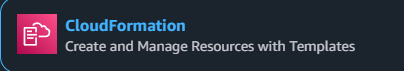

# ☁️ Laboratório AWS CloudFormation - Infraestrutura como Código

<div align="center">
  
  
  [](https://aws.amazon.com/)
  [](https://aws.amazon.com/cloudformation/)
  [](LICENSE)
</div>

## 🌟 Visão Geral

Bem-vindo ao Laboratório de Templates AWS CloudFormation! Este repositório contém uma coleção de templates CloudFormation cuidadosamente elaborados, utilizados no curso "Fundamentos AWS". Aprenda como implantar e gerenciar infraestrutura AWS usando Infraestrutura como Código (IaC).

### 🎯 O Que Você Vai Construir

Transforme sua implantação de infraestrutura AWS com estes templates que demonstram:
- Criação automatizada de instâncias EC2
- Configuração de servidor web com Apache
- Configurações de grupos de segurança
- Infraestrutura completa com S3, IAM e muito mais!

## 📚 Coleção de Templates


### 1. EC2 Básico (`01-EC2.yaml`)
- 🚀 Implantação simples de instância EC2
- 💻 AMI e tipo de instância fixos
- Perfeito para começar!


### 2. Servidor Apache (`02-Apache.yaml`)
- 🌐 Instalação automatizada do Apache
- 🔄 Configuração do serviço com UserData
- 📝 Configuração de página de boas-vindas personalizada

```yaml
AWSTemplateFormatVersion: '2010-09-09'
Description: Instalar Servidor Apache

Resources:
  # Grupo de segurança permitindo acesso HTTP
  WebServerSecurityGroup:
    Type: AWS::EC2::SecurityGroup
    Properties:
      GroupDescription: Permitir acesso HTTP
      SecurityGroupIngress:
        - IpProtocol: tcp
          FromPort: 80
          ToPort: 80
          CidrIp: 0.0.0.0/0

  # Instância EC2 com Apache
  MinhaInstancia:
    Type: AWS::EC2::Instance
    Properties:
      AvailabilityZone: us-east-1a
      ImageId: ami-0c02fb55956c7d316  # Amazon Linux 2 para us-east-1
      InstanceType: t2.micro
      KeyName: sua-chave-ssh  # Substitua pelo nome do seu par de chaves
      SecurityGroups:
        - !Ref WebServerSecurityGroup
      Tags:
        - Key: Name
          Value: Webserver-Apache
      UserData:
        Fn::Base64: !Sub |
          #!/bin/bash -xe
          yum update -y
          yum install -y httpd
          systemctl start httpd
          systemctl enable httpd
          echo "<h1>OLA AWS FOUNDATIONS do $(hostname -f)</h1>" > /var/www/html/index.html
```

### 3. Configuração de Firewall (`03-Firewall.yaml`)
- 🛡️ Configuração de grupo de segurança
- 🌍 Acesso HTTP (Porta 80)
- 🔒 Gerenciamento de tráfego web

### 4. Infraestrutura Completa (`04-EC2_S3_UserGroup.yaml`)
- 🏗️ Implantação full stack
- 📦 Criação de bucket S3
- 👥 Gerenciamento de usuário/grupo IAM
- 🔐 Grupo de segurança com acesso SSH

## 🚀 Começando

### Pré-requisitos

Antes de começar, certifique-se de ter:

✅ Uma conta AWS com as permissões apropriadas
✅ AWS CLI configurada (`aws configure`) ou acesso ao Console AWS
✅ Par de chaves SSH (KeyPair) criado em sua região de destino
⚠️ Nota: Nomes de buckets S3 devem ser globalmente únicos


### 🖥️ Métodos de Implantação

#### Via Console AWS


1. Navegue até o AWS CloudFormation
2. Clique em "Criar Stack" → "Com novos recursos (padrão)"
3. Faça upload do template YAML escolhido
4. Configure os parâmetros (ex.: InstanceType, KeyName)
5. Reconheça as capacidades IAM se necessário
6. Crie e monitore o progresso da stack

#### Via AWS CLI

```bash
# Implante a infraestrutura completa
aws cloudformation deploy \
  --template-file 04-EC2_S3_UserGroup.yaml \
  --stack-name lab-foundation-stack \
  --parameter-overrides InstanceType=t2.micro \
  --capabilities CAPABILITY_NAMED_IAM
```


## 🏗️ Visão Geral da Arquitetura


### Notas Importantes dos Templates

#### 🔧 Requisitos de Configuração

Para `04-EC2_S3_UserGroup.yaml`:

```yaml
Modificações Necessárias:
├── KeyName: Substitua 'your-key-pair-name' pelo seu par de chaves existente
├── VpcId: Atualize 'vpc-040a4ffd0374c4cf3' com seu ID de VPC
└── BucketName: Altere 'S3-FOUNDATION' para um nome único
```

⚠️ **Melhores Práticas de Segurança**
- Mapeamentos de AMI devem ser validados para sua região
- Restrinja o acesso SSH (0.0.0.0/0) em produção
- Use nomes únicos para buckets S3

### 🔍 Validação de Recursos


#### Instâncias EC2
1. Acesse o Painel EC2
2. Verifique o status da instância
3. Confirme IP Público e Grupos de Segurança

#### Servidor Web (Apache)
1. Acesse `http://<PublicIP>`
2. Verifique a página de boas-vindas
3. Teste a acessibilidade HTTP

#### Bucket S3
1. Abra o Console S3
2. Localize seu bucket criado
3. Verifique as permissões

#### Configuração IAM
1. Verifique Usuários IAM
2. Confirme associações de Grupo
3. Revise políticas anexadas

## 📸 Capturas de Tela da Implementação

### Criação da Stack


### Visão Geral dos Recursos
<div align="center">
  
  
</div>

### Configuração IAM


## 🧹 Instruções de Limpeza

Para evitar cobranças desnecessárias da AWS:

1. Abra o Console AWS CloudFormation
2. Selecione sua stack
3. Clique em "Excluir Stack"
4. Confirme a exclusão


## 🤝 Contribuindo

Contribuições são bem-vindas! Veja como você pode ajudar:

1. Faça um Fork do repositório
2. Crie sua branch de feature
3. Faça seus commits
4. Envie para a branch
5. Abra um Pull Request

---

<div align="center">

### ⭐ Favorite este repositório se ele foi útil para você! ⭐


</div>

<!-- Fim do README -->
