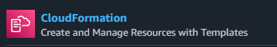
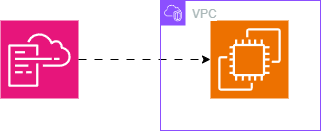
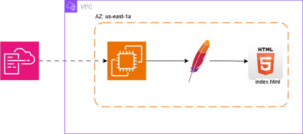
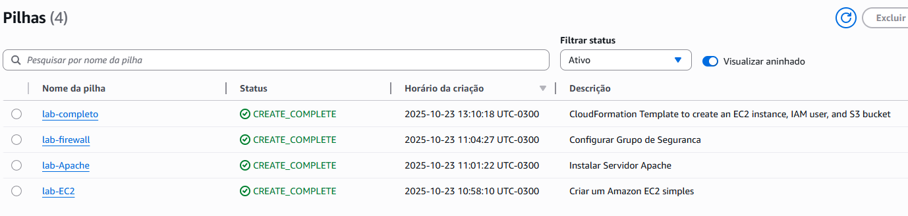
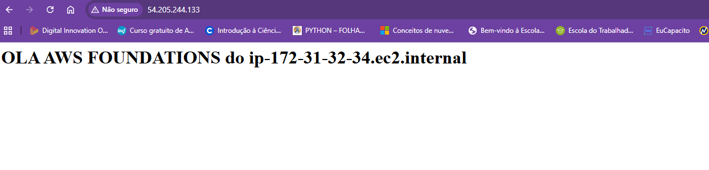
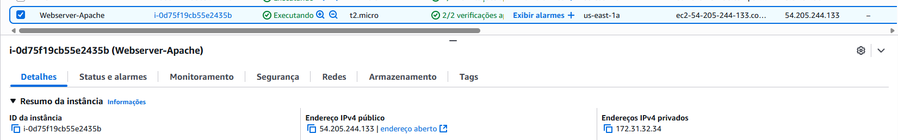

# ☁️ Laboratório AWS CloudFormation - Infraestrutura como Código

<div align="center">
  
  
  [](https://aws.amazon.com/)
  [](https://aws.amazon.com/cloudformation/)
  
</div>

## 🌟 Visão Geral

Bem-vindo ao Laboratório de Templates AWS CloudFormation! Este repositório contém uma coleção de templates CloudFormation cuidadosamente elaborados, utilizados no curso "Fundamentos AWS". Aprenda como implantar e gerenciar infraestrutura AWS usando Infraestrutura como Código (IaC).

### 🎯 O Que Você Vai Construir

Transforme sua implantação de infraestrutura AWS com estes templates que demonstram:
- Criação automatizada de instâncias EC2
- Configuração de servidor web com Apache
- Configurações de grupos de segurança
- Infraestrutura completa com S3, IAM e muito mais!

## 📚 Coleção de Templates



### 1. EC2 Básico (`01-EC2.yaml`)
- 🚀 Implantação simples de instância EC2
- 💻 AMI e tipo de instância fixos

 ```yaml
Resources:
  MinhaInstancia:
    Type: AWS::EC2::Instance
    Properties:
      AvailabilityZone: us-east-1a
      ImageId: ami-0ed9277fb7eb570c9
      InstanceType: t2.micro
      Tags :
        - Key: "Name"
          Value: "EC2"  
  ```




### 2. Servidor Apache (`02-Apache.yaml`)
- 🌐 Instalação automatizada do Apache
- 🔄 Configuração do serviço com UserData
- 📝 Configuração de página de boas-vindas personalizada

```yaml
AWSTemplateFormatVersion: '2010-09-09'
Description: Instalar Servidor Apache

Resources:
  # Grupo de segurança permitindo acesso HTTP
  WebServerSecurityGroup:
    Type: AWS::EC2::SecurityGroup
    Properties:
      GroupDescription: Permitir acesso HTTP
      SecurityGroupIngress:
        - IpProtocol: tcp
          FromPort: 80
          ToPort: 80
          CidrIp: 0.0.0.0/0

  # Instância EC2 com Apache
  MinhaInstancia:
    Type: AWS::EC2::Instance
    Properties:
      AvailabilityZone: us-east-1a
      ImageId: ami-0c02fb55956c7d316  # Amazon Linux 2 para us-east-1
      InstanceType: t2.micro
      KeyName: sua-chave-ssh  # Substitua pelo nome do seu par de chaves
      SecurityGroups:
        - !Ref WebServerSecurityGroup
      Tags:
        - Key: Name
          Value: Webserver-Apache
      UserData:
        Fn::Base64: !Sub |
          #!/bin/bash -xe
          yum update -y
          yum install -y httpd
          systemctl start httpd
          systemctl enable httpd
          echo "<h1>OLA AWS FOUNDATIONS do $(hostname -f)</h1>" > /var/www/html/index.html
```

### 3. Configuração de Firewall (`03-Firewall.yaml`)
- 🛡️ Configuração de grupo de segurança
- 🌍 Acesso HTTP (Porta 80)
- 🔒 Gerenciamento de tráfego web

```yaml
Resources:
  MinhaInstancia:
    Type: AWS::EC2::Instance
    Properties:
      AvailabilityZone: us-east-1a
      ImageId: ami-0ed9277fb7eb570c9
      InstanceType: t2.micro
      Tags :
        - Key: "Name"
          Value: "Webserver-Firewall"
      UserData:
        Fn::Base64:
          !Sub |
            #!/bin/bash -xe
            yum install -y httpd.x86_64
            systemctl start httpd.service
            systemctl enable httpd.service
            echo "<h1>OLA AWS FOUNDATIONS do $(hostname -f)</h1>" > /var/www/html/index.html
      SecurityGroups:
      - !Ref GrupoSeguranca

  GrupoSeguranca:
    Type: AWS::EC2::SecurityGroup
    Properties:
      GroupDescription: Acesso Liberado Porta 80
      SecurityGroupIngress:
      - IpProtocol: tcp
        FromPort: 80
        ToPort: 80
        CidrIp: 0.0.0.0/0
```

### 4. Infraestrutura Completa (`04-EC2_S3_UserGroup.yaml`)
- 🏗️ Implantação full stack
- 📦 Criação de bucket S3
- 👥 Gerenciamento de usuário/grupo IAM
- 🔐 Grupo de segurança com acesso SSH

```yaml
AWSTemplateFormatVersion: '2010-09-09'
Description: CloudFormation Template para EC2 com Apache, IAM e S3

Parameters:
  InstanceType:
    Type: String
    Default: t2.micro
    Description: Tipo de instância EC2 (AMD64/x86_64)
    AllowedValues:
      - t2.micro
      - t3.micro
    ConstraintDescription: Deve ser um tipo válido de instância EC2 AMD64.

Resources:
  S3Bucket:
    Type: 'AWS::S3::Bucket'
    Properties:
      BucketName: s3-foundatiion-ejfm-dio

  IAMGroup:
    Type: 'AWS::IAM::Group'
    Properties:
      GroupName: GPO-ADMIN-LAB

  IAMUser:
    Type: 'AWS::IAM::User'
    Properties:
      UserName: administrator-test
      Groups:
        - !Ref IAMGroup

  EC2SecurityGroup:
    Type: 'AWS::EC2::SecurityGroup'
    Properties:
      GroupDescription: Acesso SSH e HTTP
      VpcId: vpc-05df2006425ca3f72
      SecurityGroupIngress:
        - IpProtocol: tcp
          FromPort: '22'
          ToPort: '22'
          CidrIp: 0.0.0.0/0
        - IpProtocol: tcp
          FromPort: '80'
          ToPort: '80'
          CidrIp: 0.0.0.0/0

  EC2Instance:
    Type: 'AWS::EC2::Instance'
    Properties:
      InstanceType: !Ref InstanceType
      ImageId: !FindInMap [UbuntuMap, !Ref "AWS::Region", UbuntuAMI]
      KeyName: ChavesLinux
      NetworkInterfaces:
        - AssociatePublicIpAddress: true
          DeviceIndex: 0
          SubnetId: subnet-xxxxxxxx  # Substitua pelo ID da sua sub-rede pública
          GroupSet:
            - !Ref EC2SecurityGroup
      UserData:
        Fn::Base64: !Sub |
          #!/bin/bash
          apt-get update
          apt-get install -y apache2
          systemctl start apache2
          systemctl enable apache2

Mappings:
  UbuntuMap:
    us-east-1:
      UbuntuAMI: ami-0c398cb65a93047f2

Outputs:
  InstanceId:
    Description: ID da instância EC2
    Value: !Ref EC2Instance
  S3BucketName:
    Description: Nome do bucket S3
    Value: !Ref S3Bucket
  IAMUserName:
    Description: Nome do usuário IAM
    Value: !Ref IAMUser
```

## 🚀 Começando

### Pré-requisitos

Antes de começar, certifique-se de ter:

✅ Uma conta AWS com as permissões apropriadas
✅ AWS CLI configurada (`aws configure`) ou acesso ao Console AWS
✅ Par de chaves SSH (KeyPair) criado em sua região de destino
⚠️ Nota: Nomes de buckets S3 devem ser globalmente únicos


### 🖥️ Método de Implantação utilizado

#### Via Console AWS

1. Navegue até o AWS CloudFormation
2. Clique em "Criar Stack" → "Com novos recursos (padrão)"
3. Faça upload do template YAML escolhido
4. Configure os parâmetros (ex.: InstanceType, KeyName)
5. Reconheça as capacidades IAM se necessário
6. Crie e monitore o progresso da stack

#### 🔧 Requisitos de Configuração

Para `04-EC2_S3_UserGroup.yaml`:

```yaml
Modificações Necessárias:
├── KeyName: Substitua 'your-key-pair-name' pelo seu par de chaves existente
├── VpcId: Atualize 'vpc-040a4ffd0374c4cf3' com seu ID de VPC
└── BucketName: Altere 'S3-FOUNDATION' para um nome único
```

⚠️ **Melhores Práticas de Segurança**
- Mapeamentos de AMI devem ser validados para sua região
- Restrinja o acesso SSH (0.0.0.0/0) em produção
- Use nomes únicos para buckets S3

### 🔍 Validação de Recursos



#### Instâncias EC2
1. Acesse o Painel EC2
2. Verifique o status da instância
3. Confirme IP Público e Grupos de Segurança

#### Servidor Web (Apache)
1. Acesse `http://<PublicIP>`
2. Verifique a página de boas-vindas
3. Teste a acessibilidade HTTP




#### Bucket S3
1. Abra o Console S3
2. Localize seu bucket criado
3. Verifique as permissões

#### Configuração IAM
1. Verifique Usuários IAM
2. Confirme associações de Grupo
3. Revise políticas anexadas

## 📸 Capturas de Tela da Implementação

### Criação da Stack


## 🧹 Instruções de Limpeza

Para evitar cobranças desnecessárias da AWS:

1. Abra o Console AWS CloudFormation
2. Selecione sua stack
3. Clique em "Excluir Stack"
4. Confirme a exclusão


</div>

<!-- Fim do README -->
